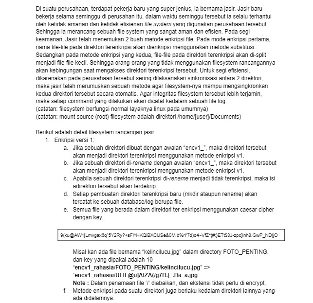

# SoalShiftSISOP20_modul4_T01
Repository ini sebagai Laporan Resmi Soal Shift Sisop Modul 4, Praktikum Sistem Operasi 2020

### Disusun oleh :
- Anis Saidatur Rochma    [0531184000002]
- Kadek Nesya Kurniadewi  [05311840000009]

## 1. Enkripsi Versi 1


### Penyelesaian Soal :
1. Saat membuat direktori dengan awalan nama direktori `encv1_`, maka nama direktori tersebut akan terenkripsi isinya kecuali extensi filenya seperti : .c, .jpg, png, dan lainnya, akan tetap seperti itu (tidak terenkripsi)
2. Saat melakukan *rename* pada direktori dengan awalan `encv1_`, maka direktori tersebut akan menjadi direktori yang terenkripsi
3. Semua proses baru yang dilakukan seperti `mkdir` dan `rename` prosesnya akan tercatat ke database atau log yang berupa file

### Langkah-langkah :
1. Masuk ke Direktori Modul 4
- Syntax : `cd modul4`
2. Melakukan pengecekan isi direktory menggunakan `ls`. Pada modul 4 sudah ada file dengan nama "**encv1_**", "**ssfs**", dan "**ssfs.c**"
3. Kemudian melakukan compile pada file ssfs.c yang sudah terdapat code untuk menyelesaikan permasalahan pada soal no 1 (enkripsi versi 1) diatas
- Systax compile : ``gcc -Wall `pkg-config fuse - cflags` [nama file] -o [output] `pkg-config fuse --libs``
4. Menjalankan Fuse
- Syntax : `./[output] [diretori yang dituju]` -> `./ssfs encv1_`

### Penjelasan Source Code :
```c
#define FUSE_USE_VERSION 28
#include <fuse.h>
#include <stdio.h>
#include <string.h>
#include <unistd.h>
#include <fcntl.h>
#include <dirent.h>
#include <errno.h>
#include <sys/time.h>
#include <time.h>
```
- Pertama-tama kita harus menginput library apa saja yang diperlukan, seperti library diatas

```c 
static const char *rootDir = "/home/nisyua/Documents";
static const char *key = {"9(ku@AW1[Lmvgax6q`5Y2Ry?+sF!^HKQiBXCUSe&0M.b%rI'7d)o4~VfZ*{#:}ETt$3J-zpc]lnh8,GwP_ND|jO"};
```
- `static const char *rootDir = "/home/nisyua/Documents";` code ini merupakan `rootDir` yang akan dilakukan pada direktori Documents
- `static const char *key = {"9(ku@AW1[Lmvgax6q`5Y2Ry?+sF!^HKQiBXCUSe&0M.b%rI'7d)o4~VfZ*{#:}ETt$3J-zpc]lnh8,GwP_ND|jO"};` pada code ini, akan diinput key untuk melakukan enkripsi caesar chiper pada file yang ada pada suatu direktori dengan direktori "**encv1_**"

```c
char encrypt_1[10] = "encv1_";

void encryptDecrypt(char *path, int method);
void catatLog(char *lv, char *command, int res, int lenDesc, const char *desc[]);
int findAwal(char *path, int st);
int findAkhir(char *path);
```
- Yang dienkripsi adalah direktori dengan nama "**encv1_**" menggunakan code `char encrypt_1[10] = "encv1_";`

```c
static int xmp_getattr(const char *path, struct stat * stbuf){
    int res = 0;
    char fpath[1000];

    char *dirTemp = strstr(path, encrypt_1);
    if(dirTemp != NULL){
        encryptDecrypt(dirTemp, 0);
    }

    if(strcmp(path, "/") == 0){
        sprintf(fpath, "%s", rootDir);
    } else{
        sprintf(fpath, "%s%s", rootDir, path);
    }

    res = lstat(fpath, stbuf);

    const char *desc[] = {fpath};
    catatLog("INFO", "GETATTR", res, 1, desc);
    
    if(res == -1){
        return -errno;
    }

    return 0;
}
```
- Fungsi dari `getattr` adalah untuk mendapatkan nilai atribut suatu objek
- Fungsi ini akan dipanggil saat system membutuhkan atribut dari suatu file

 ```c
 static int xmp_readdir(const char *path, void *buf, fuse_fill_dir_t filler, off_t offset, struct fuse_file_info *fi){
    char fpath[1000];

    char *dirTemp = strstr(path, encrypt_1);
    if(dirTemp != NULL){
        encryptDecrypt(dirTemp, 0);
    }

    if(strcmp(path, "/") == 0){
        sprintf(fpath, "%s", rootDir);
    } else{
        sprintf(fpath, "%s%s", rootDir, path);
    }

    DIR *dp;
    struct dirent *de;
    (void) offset;
    (void) fi;
    int res = 0;

    dp = opendir(fpath);

    if(dp == NULL){
        return -errno;
    }

    while((de = readdir(dp)) != NULL){
        struct stat st;
        memset(&st, 0, sizeof(st));

        st.st_ino = de->d_ino;
        st.st_mode = de->d_type << 12;

        printf("Before: %s\n", de->d_name);

        if(dirTemp != NULL){
            encryptDecrypt(de->d_name, 1);
        }

        printf("After: %s\n", de->d_name);

        res = (filler(buf, de->d_name, &st, 0));

        if(res != 0){
            break;
        }
    }

    closedir(dp);

    return 0;
}
```
- Menginput fungsi `readdir` yang digunakan untuk membaca direktori
- `readdir` ini akan digunakan saat user memerlukan untuk memanggil suatu direktori atau file isi direktori yang spesifik

```c
static int xmp_mkdir(const char *path, mode_t mode){
    char fpath[1000];

    char *dirTemp = strstr(path, encrypt_1);
    if(dirTemp != NULL){
        encryptDecrypt(dirTemp, 0);
    }

    if(strcmp(path, "/") == 0){
        sprintf(fpath, "%s", rootDir);
    } else{
        sprintf(fpath, "%s%s", rootDir, path);
    }

    int res=0;
    res = mkdir(fpath, mode);
    
    if(res == -1){
        return -errno;
    }

    const char *desc[] = {fpath};
    catatLog("INFO", "MKDIR", res, 1, desc);

    return 0;
}
```
- Fungsi `mkdir` yang digunakan untuk membuat direktori baru
- Code diatas akan dipanggil saat user akan membuat direktori baru

```c
static int xmp_rename(const char *from, const char *to){
    int res;
    char fpath[1000], fpathf[1000];

    char *dirTemp = strstr(to, encrypt_1);
    if(dirTemp != NULL){
        encryptDecrypt(dirTemp, 0);
    }

    sprintf(fpath, "%s%s", rootDir, from);
    sprintf(fpathf, "%s%s", rootDir, to);

    res = rename(fpath, fpathf);

    if(res == -1){
        return -errno;
    }

    const char *desc[] = {fpath, fpathf};
    catatLog("INFO", "RENAME", res, 2, desc);

    return 0;
}
```
- Code `rename` diatas digunakan untuk melakukan rename pada suatu file spesifik

```c
static int xmp_rmdir(const char *path){
    int res;
    char fpath[1000];

    char *dirTemp = strstr(path, encrypt_1);
    if(dirTemp != NULL){
        encryptDecrypt(dirTemp, 0);
    }

    if(strcmp(path, "/") == 0){
        sprintf(fpath, "%s", rootDir);
    } else{
        sprintf(fpath, "%s%s", rootDir, path);
    }

    res = rmdir(fpath);

    if(res == -1){
        return -errno;
    }

    const char *desc[] = {fpath};
    catatLog("WARNING", "RMDIR", res, 1, desc);

    return 0;
}
```
- Fungsi `rmdir` digunakan untuk melakukan Remove Directory
- Fungsi ini akan dipanggil saat melakukan proses remove atau penghapusan suatu file ataupun directory

```c
static int xmp_read(const char *path, char *buf, size_t size, off_t offset, struct fuse_file_info *fi){
    int res, fd;
    char fpath[1000];

    char *dirTemp = strstr(path, encrypt_1);
    if(dirTemp != NULL){
        encryptDecrypt(dirTemp, 0);
    }

    if(strcmp(path, "/") == 0){
        sprintf(fpath, "%s", rootDir);
    } else{
        sprintf(fpath, "%s%s", rootDir, path);
    }

    res = 0;
    fd = 0;
    (void) fi;

    fd = open(fpath, O_RDONLY);

    if(fd == -1){
        return -errno;
    }

    res = pread(fd, buf, size, offset);

    if(res == -1){
        res = -errno;
    }

    close(fd);

    return res;
}
```
- Fungsi `read` ini digunakan untuk membaca suatu direktory atau file yang ada pada file yang saat ini kita buka
- Fungsi ini akan dipanggil saat memerlukan untuk membaca satu demi satu file dari suatu direktori

```c
static int xmp_mknod(const char *path, mode_t mode, dev_t rdev){
    int res;
    char fpath[1000];

    char *dirTemp = strstr(path, encrypt_1);
    if(dirTemp != NULL){
        encryptDecrypt(dirTemp, 0);
    }

    if(strcmp(path, "/") == 0){
        sprintf(fpath, "%s", rootDir);
    } else{
        sprintf(fpath, "%s%s", rootDir, path);
    }

    if(S_ISREG(mode)){
        res = open(path, O_CREAT | O_EXCL | O_WRONLY, mode);
        if(res >= 0){
            res = close(res);
        }
    } else if(S_ISFIFO(mode)){
        res = mkfifo(path, mode);
    } else {
        res = mknod(path, mode, rdev);
    }

    if(res == -1){
        return -errno;
    }
    
    const char *desc[] = {fpath};
    catatLog("INFO", "MKNODE", res, 1, desc);

    return 0;
}
```
- Fungsi `mknod` yang berfungsi untuk membuat file node baru (membuat blok atau karakter file khusus)

```c
static int xmp_unlink(const char *path){
    int res;
    char fpath[1000];

    char *dirTemp = strstr(path, encrypt_1);
    if(dirTemp != NULL){
        encryptDecrypt(dirTemp, 0);
    }

    if(strcmp(path, "/") == 0){
        sprintf(fpath, "%s", rootDir);
    } else{
        sprintf(fpath, "%s%s", rootDir, path);
    }

    res = unlink(fpath);

    if(res == -1){
        return -errno;
    }
    
    const char *desc[] = {fpath};
    catatLog("WARNING", "UNLINK", res, 1, desc);

    return 0;
}
```
- Fungsi `unlink` digunakan unutk menghapus file secara permanen

```c
static int xmp_write(const char *path, const char *buf, size_t size, off_t offset, struct fuse_file_info *fi){
    char fpath[1000];

    char *dirTemp = strstr(path, encrypt_1);
    if(dirTemp != NULL){
        encryptDecrypt(dirTemp, 0);
    }

    if(strcmp(path, "/") == 0){
        sprintf(fpath, "%s", rootDir);
    } else{
        sprintf(fpath, "%s%s", rootDir, path);
    }
    
    (void) fi;
    int fd, res;
    
    fd = open(fpath, O_WRONLY);

    if(fd == -1){
        return -errno;
    }
    
    res = pwrite(fd, buf, size, offset);

    if(res == -1){
        res = -errno;
    }
    
    close(fd);
    
    return res;
}
```
- Fungsi `write` digunakan untuk mengirim data ke file/direktori yang terbuka(sedang dibuka)

```c
static int xmp_truncate(const char *path, off_t size){
    int res;
    char fpath[1000];

    char *dirTemp = strstr(path, encrypt_1);
    if(dirTemp != NULL){
        encryptDecrypt(dirTemp, 0);
    }

    if(strcmp(path, "/") == 0){
        sprintf(fpath, "%s", rootDir);
    } else{
        sprintf(fpath, "%s%s", rootDir, path);
    }

    res = truncate(fpath, size);
    
    if(res == -1){
        return -errno;
    }

    return 0;
}
```
- Fungsi `truncate` digunakan untuk mengganti size dari suatu file

```c
static int xmp_create(const char *path, mode_t mode, struct fuse_file_info *fi){
    int res;
    char fpath[1000];
    (void)fi;

    char *dirTemp = strstr(path, encrypt_1);
    if(dirTemp != NULL){
        encryptDecrypt(dirTemp, 0);
    }

    if(strcmp(path, "/") == 0){
        sprintf(fpath, "%s", rootDir);
    } else{
        sprintf(fpath, "%s%s", rootDir, path);
    }

    res = creat(fpath, mode);
    
    if(res == -1){
        return -errno;
    }

    close(res);

    return 0;
}
```
- Fungsi `create` digunakan untuk Create dan membuka file

```c
static int xmp_utimens(const char *path, const struct timespec ts[2]){
    int res;
    char fpath[1000];

    char *dirTemp = strstr(path, encrypt_1);
    if(dirTemp != NULL){
        encryptDecrypt(dirTemp, 0);
    }

    if(strcmp(path, "/") == 0){
        sprintf(fpath, "%s", rootDir);
    } else{
        sprintf(fpath, "%s%s", rootDir, path);
    }

	struct timeval tv[2];

	tv[0].tv_sec = ts[0].tv_sec;
	tv[0].tv_usec = ts[0].tv_nsec / 1000;
	tv[1].tv_sec = ts[1].tv_sec;
	tv[1].tv_usec = ts[1].tv_nsec / 1000;

    res = utimes(fpath, tv);
    
    if(res == -1){
        return -errno;
    }

    return 0;
}
```
- Fungsi `utimens` digunakan untuk mengubah waktu akses dan memodifikasi file dengan resolusi nanosecond

```c
static int xmp_access(const char *path, int mask){
    int res;
    char fpath[1000];

    char *dirTemp = strstr(path, encrypt_1);
    if(dirTemp != NULL){
        encryptDecrypt(dirTemp, 0);
    }

    if(strcmp(path, "/") == 0){
        sprintf(fpath, "%s", rootDir);
    } else{
        sprintf(fpath, "%s%s", rootDir, path);
    }

    res = access(fpath, mask);
    
    if(res == -1){
        return -errno;
    }

    return 0;
}
```
- Fungsi `access` digunakan untuk melakukan Check file access permissions. Fungsi ini akan dipanggil untuk panggilan sistem access(). Jika opsi mount 'default_permissions' diberikan, metode ini tidak dipanggil.

```c
static int xmp_open(const char *path, struct fuse_file_info *fi){
    int res;
    char fpath[1000];

    char *dirTemp = strstr(path, encrypt_1);
    if(dirTemp != NULL){
        encryptDecrypt(dirTemp, 0);
    }

    if(strcmp(path, "/") == 0){
        sprintf(fpath, "%s", rootDir);
    } else{
        sprintf(fpath, "%s%s", rootDir, path);
    }

    res = access(fpath, fi->flags);
    
    if(res == -1){
        return -errno;
    }

    close(res);
    return 0;
}
``` 
- Fungsi `open` digunakan untuk membuka file

```c
void encryptDecrypt(char *path, int method){
    if(!strcmp(path, ".") || !strcmp(path, "..")){
        return;
    }

    int cnt, sw, charAwal, charAkhir;
    
    charAkhir = findAkhir(path);

    if(method == 1){
        sw = 10;
        charAwal = findAwal(path, 0);
    } else if(method == 0){
        sw = strlen(key) - 10;
        charAwal = findAwal(path, charAkhir);
    }

    for(int i=charAwal; i<charAkhir; i++){
        if(path[i] != '/'){
            for(int j=0; j<strlen(key); j++){
                if(key[j] == path[i]){
                    cnt = (j+sw) % strlen(key);
                    path[i] = key[cnt];

                    break;
                }
            }
        }
    }
}
```
- Fungsi `encryptDecrypt` digunakan unutk melakukan operasi enkripsi dan dekripsi dari suatu file

### ScreenShot :
- Cara menjalannkannya

- Isi pada direktori Documents

- Kemudian membuka folder encv1_ yang isinya seperti gambar dbawah ini 

- Kemudian isi folder dari "**lalalala**" adalah (Foto Folder Sebelum di-Enkripsi)

- Saat code sudah dijalankan (Sudah di-Enkripsi), outputnya adalah 


## 4. Log System

- Untuk melihat proses log, kami menamakan filenya sebagai **fs.txt**

Untuk memenuhi persyaratan diatas, kita menggunakan code seperti dibawah ini :
```c
static const char *logsys = "/home/nisyua/modul4/fs.txt";
```
- Kode diatas `static const char *logsys = "/home/nisyua/modul4/fs.txt";` merupakan code yang digunakan untuk menyimpan log system yang berjalan pada "**modul4**" dengan nama file "**fs.txt**"

```c
void catatLog(char *lv, char *command, int res, int lenDesc, const char *desc[]){
    FILE *file = fopen(logsys, "a+");
    time_t t;
    struct tm *tm;
    char timeTemp[100];
    time(&t);
    tm = localtime(&t);
    
    strftime(timeTemp, sizeof(timeTemp), "%y%m%d-%H:%M:%S", tm);

    char logTemp[1000];
    sprintf(logTemp, "%s::%s::%s::%d", lv, timeTemp, command, res);
    
    for(int i=0; i<lenDesc; i++){
        sprintf(logTemp, "%s::%s", logTemp, desc[i]);
    }

    sprintf(logTemp, "%s\n", logTemp);

    fputs(logTemp, file);

    fclose(file);
}
```
- Fungsi `catat log` digunakan untuk mencatat log yang dijalankan.
```c
time_t t;
    struct tm *tm;
    char timeTemp[100];
    time(&t);
    tm = localtime(&t);
    
    strftime(timeTemp, sizeof(timeTemp), "%y%m%d-%H:%M:%S", tm);
```
- Kode ini digunakan untuk membuat format log yang diminta sesuai soal yaitu `"%y%m%d-%H:%M:%S"`
```c
char logTemp[1000];
    sprintf(logTemp, "%s::%s::%s::%d", lv, timeTemp, command, res);
```
- Fungsi ini digunakan untuk melakukan pencatatan log dengan format yang sudah ditentukan

```c
static struct fuse_operations xmp_oper = {
    .getattr = xmp_getattr,
    .readdir = xmp_readdir,
    .read = xmp_read,
    .mkdir = xmp_mkdir,
    .rmdir = xmp_rmdir,
    .rename = xmp_rename,
    .truncate = xmp_truncate,
    .write = xmp_write,
    .create = xmp_create,
    .utimens = xmp_utimens,
    .access = xmp_access,
    .open = xmp_open,
    .mknod = xmp_mknod,
    .unlink = xmp_unlink,
};
```
Diatas ini merupakan fungsi `fuse_operations`
- Diatas merupakan atribut pada `struct` yang merupakan pointer menuju ke fungsi yang digunakan atau dipanggil. Setiap fungsi diatas disebut dengan "**FUSE**" saat suatu kejadian spesifik yang terjadi pada file system.

### ScreenShot

